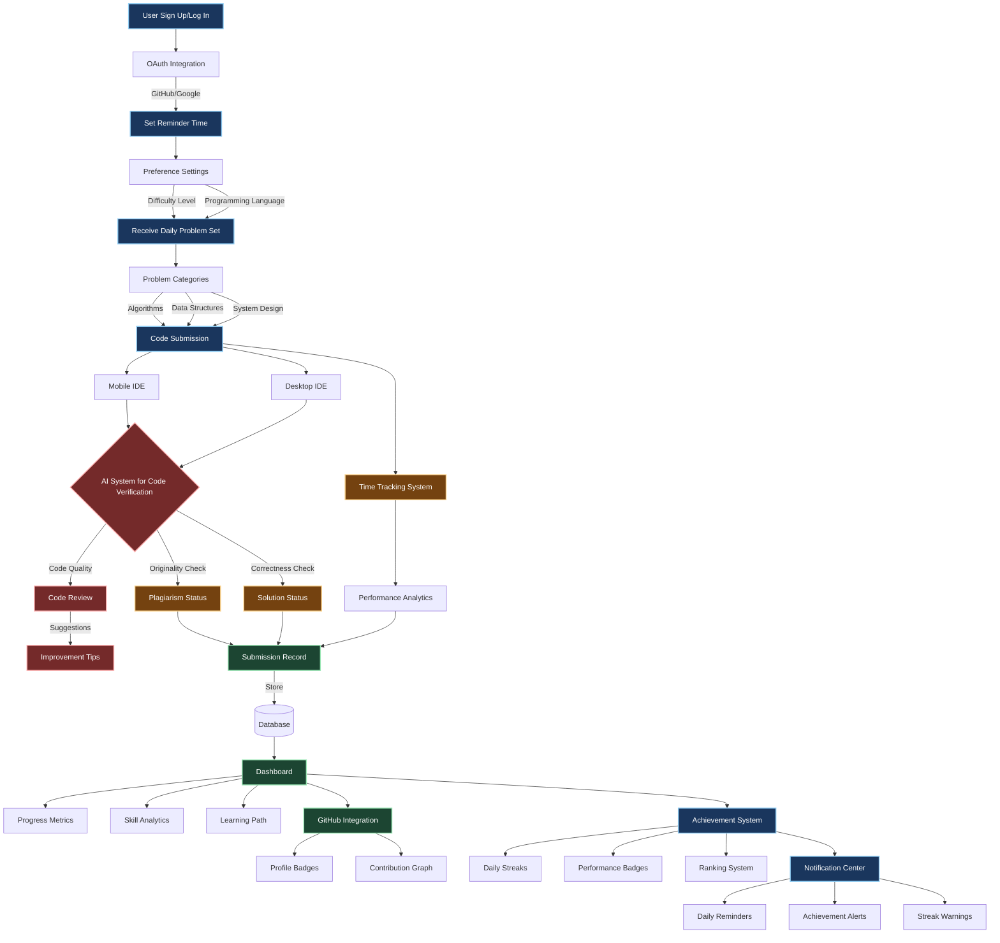

```mermaid
graph TD
    %% User Authentication and Setup
    A[User Sign Up/Log In] --> AA[OAuth Integration]
    AA --> |GitHub/Google| B[Set Reminder Time]
    B --> BB[Preference Settings]
    BB --> |Difficulty Level| C
    BB --> |Programming Language| C

    %% Core Challenge Flow
    C[Receive Daily Problem Set] --> CC[Problem Categories]
    CC --> |Algorithms| D
    CC --> |Data Structures| D
    CC --> |System Design| D

    %% Submission System
    D[Code Submission] --> DA[Mobile IDE]
    D --> DB[Desktop IDE]
    DA & DB --> E

    %% AI Verification System
    E{AI System for Code Verification} --> |Originality Check| F[Plagiarism Status]
    E --> |Correctness Check| G[Solution Status]
    E --> |Code Quality| EA[Code Review]
    EA --> |Suggestions| EB[Improvement Tips]

    %% Time Tracking
    D --> H[Time Tracking System]
    H --> HA[Performance Analytics]

    %% Record Management
    F & G & HA --> I[Submission Record]
    I --> |Store| IA[(Database)]

    %% Dashboard and Analytics
    IA --> J[Dashboard]
    J --> JA[Progress Metrics]
    J --> JB[Skill Analytics]
    J --> JC[Learning Path]

    %% GitHub Integration
    J --> K[GitHub Integration]
    K --> KA[Profile Badges]
    K --> KB[Contribution Graph]

    %% Gamification System
    J --> L[Achievement System]
    L --> LA[Daily Streaks]
    L --> LB[Performance Badges]
    L --> LC[Ranking System]

    %% Notification System
    L --> M[Notification Center]
    M --> MA[Daily Reminders]
    M --> MB[Achievement Alerts]
    M --> MC[Streak Warnings]

    %% Visual Styling
    classDef primary fill:#1a365d,stroke:#90cdf4,stroke-width:2px,color:#ffffff
    classDef secondary fill:#744210,stroke:#fbd38d,stroke-width:2px,color:#ffffff
    classDef success fill:#1c4532,stroke:#9ae6b4,stroke-width:2px,color:#ffffff
    classDef system fill:#742a2a,stroke:#feb2b2,stroke-width:2px,color:#ffffff

    class A,B,C,D primary
    class E,EA,EB system
    class F,G,H secondary
    class I,J,K success
    class L,M primary
```
